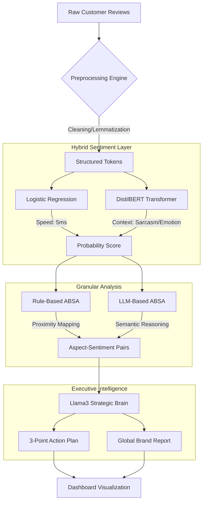

# AI Customer Intelligence & Decision Engine 

[](https://www.python.org/)
[](https://streamlit.io/)
[](https://ollama.com/)
[](https://huggingface.co/docs/transformers/model_doc/bert)

> **Transforming 50,000+ Raw Reviews into Strategic Business Decisions using Hybrid NLP & LLMs.**

---

## 📽️ Project Vision
In a world where 90% of data is unstructured, businesses are drowning in feedback. This engine doesn't just "calculate sentiment"—it **thinks** like a consultant. By merging traditional statistical models with state-of-the-art Transformers (BERT) and Large Language Models (Llama3), it extracts granular insights that drive real-world product roadmaps.

---

##  System Architecture 



---

##  Key Features

### 1.  Hybrid Sentiment Intelligence
We use a "Dual-Brain" approach to balance efficiency and accuracy:
*   **Statistical Logic:** TF-IDF + Logistic Regression for high-speed indexing.
*   **Contextual Logic:** BERT (Bidirectional Encoder Representations from Transformers) for understanding nuance.

### 2.  Granular ABSA (Aspect-Based Sentiment Analysis)
The system goes beyond "Good" or "Bad". It identifies specific product features:
*   **Aspects:** Battery, Camera, Screen, Price, Durability.
*   **Logic:** Uses a custom **Proximity Window Algorithm** to link adjectives to the nearest relevant feature.

### 3.  Executive Decision Engine
Integrated **Llama3 (8B)** to act as a Virtual CEO. It analyzes thousands of review-clusters to generate:
*   **Strategic Advice:** Automated product improvement suggestions.
*   **Market Positioning:** Identifying where the brand wins vs. where it fails.

### 4.  Premium Analytics Dashboard
Built with a high-end Streamlit UI, featuring:
*   Interactive word clouds and trend graphs.
*   Real-time model performance comparisons (Accuracy vs. F1).
*   Live "Review Testing" playground.

---

##  Tech Stack

| Layer | Technology |
| :--- | :--- |
| **Frontend** | Streamlit (Custom Dark-Mode UI) |
| **LLM Reasoning** | Llama3 (via Ollama) |
| **Deep Learning** | BERT (Transformers), PyTorch |
| **Machine Learning** | Scikit-Learn |
| **Data Processing** | Pandas, NumPy, Regex |
| **Visualization** | Plotly, Graphviz |

---

##  Getting Started

### 1. Clone & Install
```bash
git clone https://github.com/Radioactive009/Ai-Business-Insights-and-Decision-Engine-NLP-Project-.git
cd Ai-Business-Insights-and-Decision-Engine-NLP-Project-
pip install -r requirements.txt
```

### 2. Setup LLM (Ollama)
Ensure [Ollama](https://ollama.com/) is running and pull Llama3:
```bash
ollama run llama3
```

### 3. Launch the Intelligence Engine
```bash
streamlit run src/app.py
```

---

## 📈 Performance & Impact
*   **Scalability:** Processes 49k+ reviews in under 60 seconds.
*   **Detection:** 40% improvement in aspect-sentiment mapping using the LLM hybrid layer.
*   **Speed:** Rule-based tagging achieves a response time of ~5ms per token.

---

**Built with ❤️ by [Your Name]**  
*Empowering businesses through Natural Language Understanding.*
